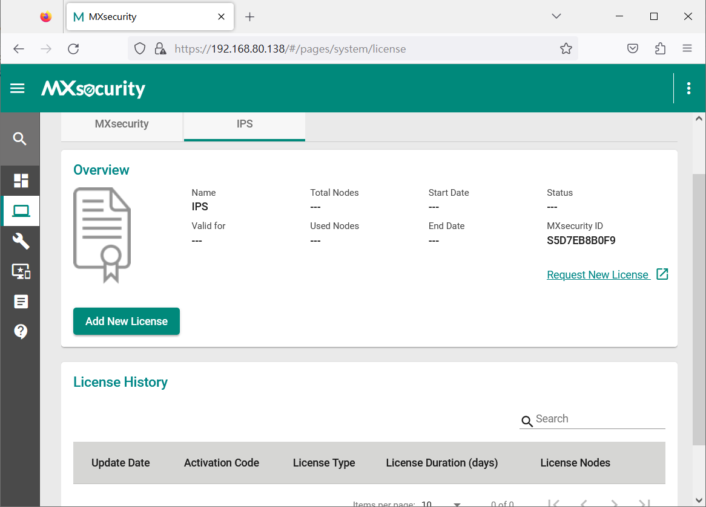
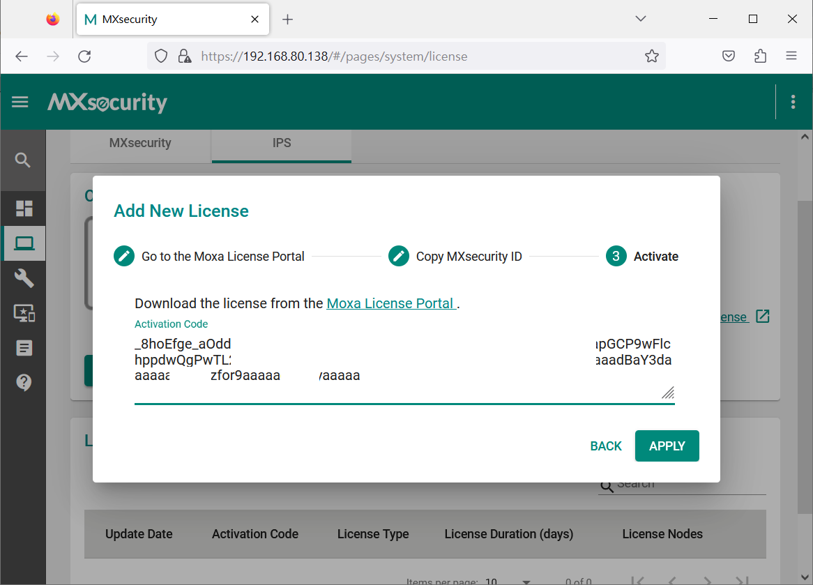
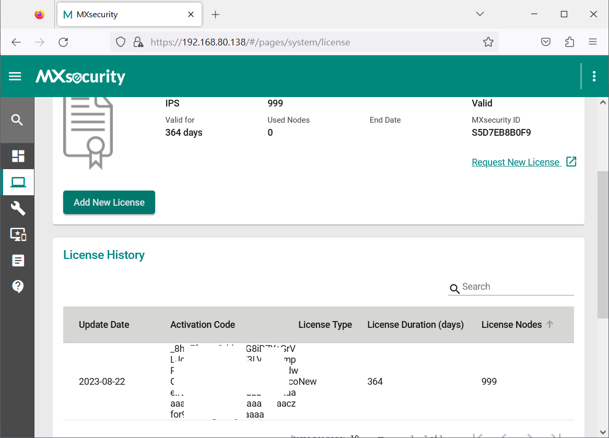

## CVE-2023-41438

- Date：2023-08-22
- Author：Sean Cai, HUANG, YU-HSIANG(Chris)

---

### Product Information

- Vendor：https://www.moxa.com/
- Product：Moxa MXsecurity Series
- Version：V1.0.1

### Description

The encryption method of the serial number generator has been compromised.

序號產生器的加密方式遭到洩漏。

### PoC

1.
    * Generate a serial number using the leaked encryption method and paste the serial number to activate the product.
    * 利用已洩漏的加密方式產生序號並貼上序號啟用產品。

