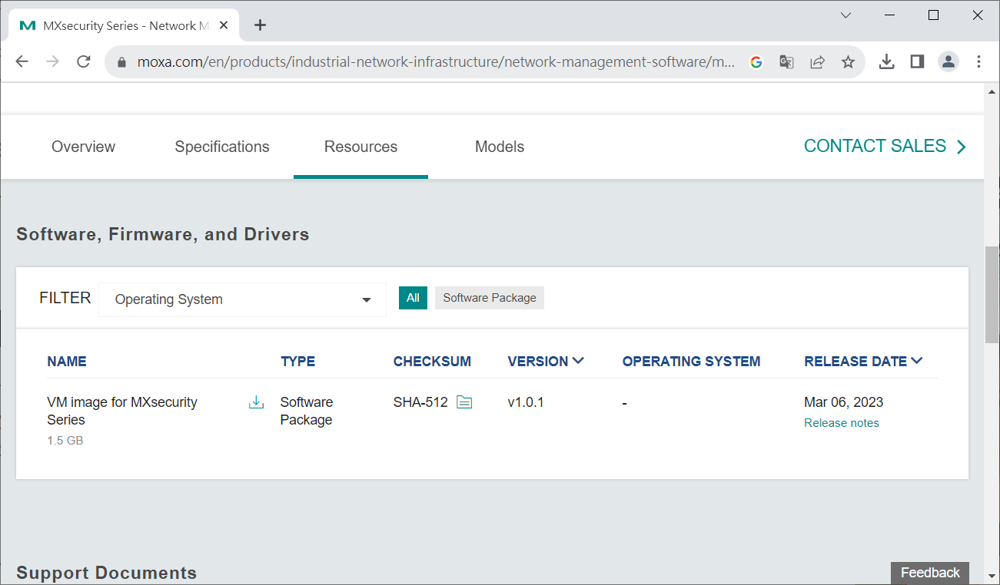
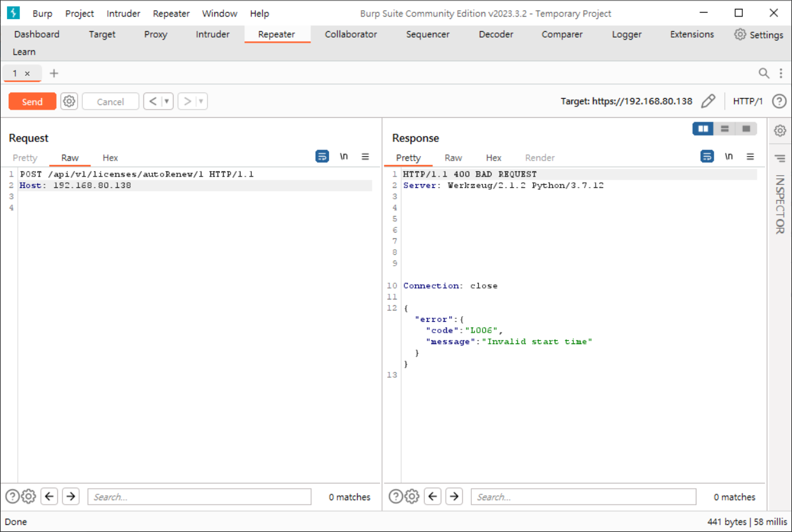
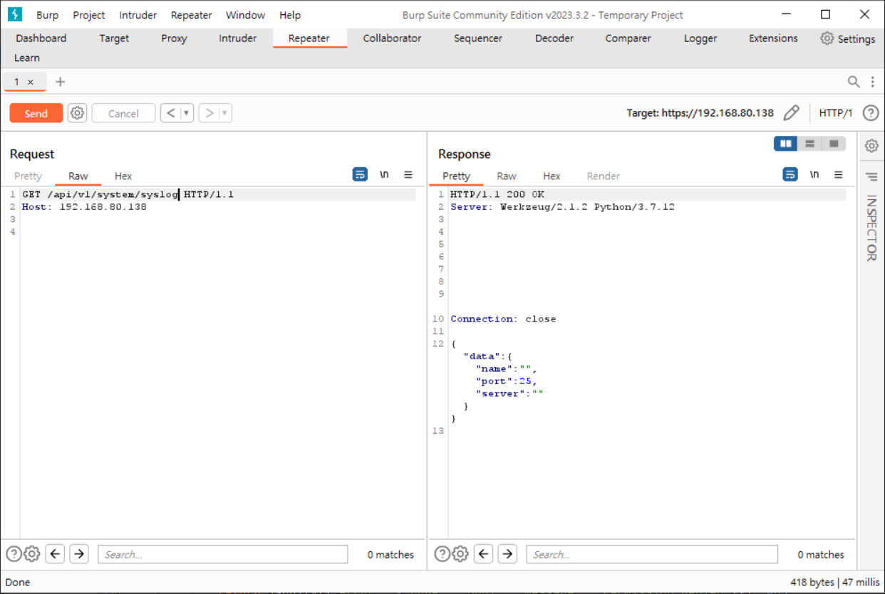
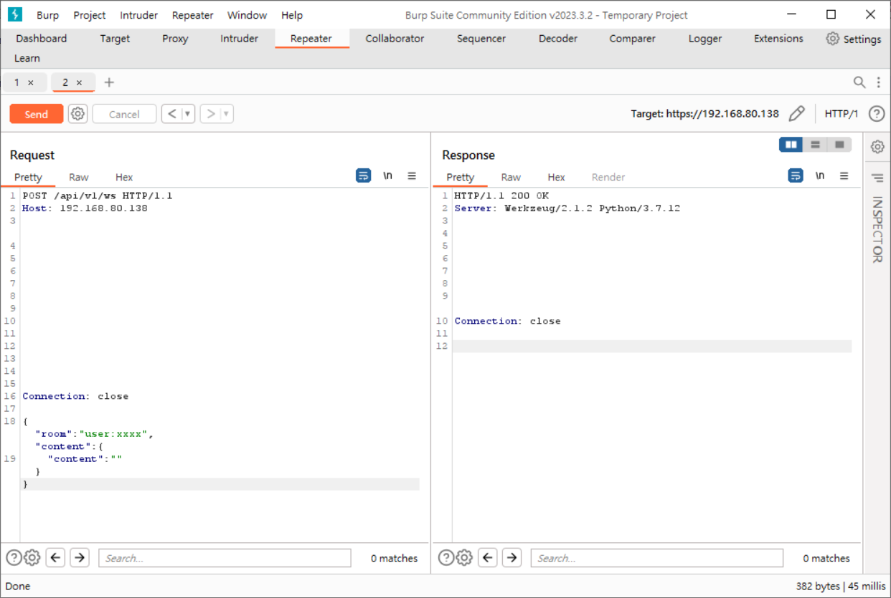
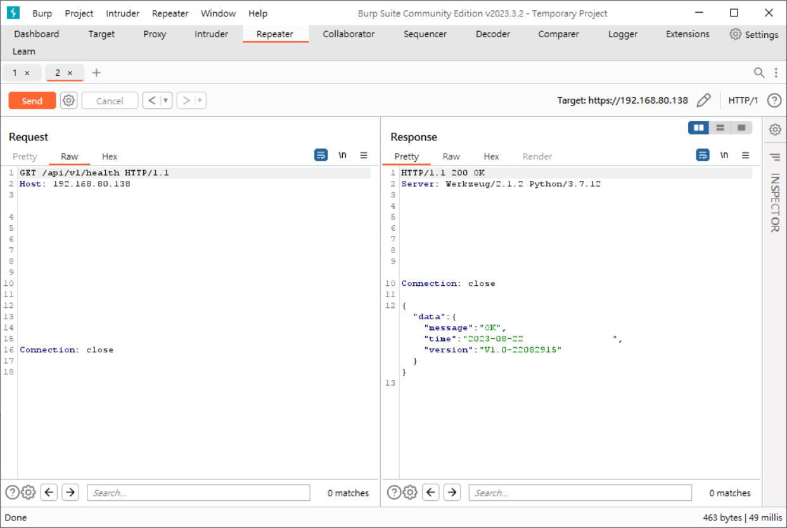

## CVE-2023-41439

- Date：2023-08-22
- Author：Sean Cai, HUANG, YU-HSIANG(Chris)

---

### Product Information

- Vendor：https://www.moxa.com/
- Product：Moxa MXsecurity Series
- Version：V1.0.1

### Description

Many API paths lack permission control, for example, some of them are as follows.

許多API路徑沒有權限控管，舉例一部分如以下：

- /api/v1/licenses/autoRenew/<id>
- /api/v1/system/syslog
- /api/v1/ws
- /api/v1/health

Resulting in issues such as system information leaks, and so on.

導致洩漏系統資訊等等的問題。

### PoC

1.
    * Download the disk image from the official website.
    * 從官方網站下載映像檔。

2.
    * Start the virtual machine and confirm the IP address.
    * 啟動虛擬機器，確認IP位置。

3.
    * Start the service and verify that the version is 1.0.1, but the message displayed on the web is showing an
      incorrect 1.0.
    * 啟動服務，確認版本為V1.0.1，但web上顯示訊息則為錯誤的V1.0。

4.
    * Confirm the presence of vulnerabilities.
    * 確認存在弱點。

