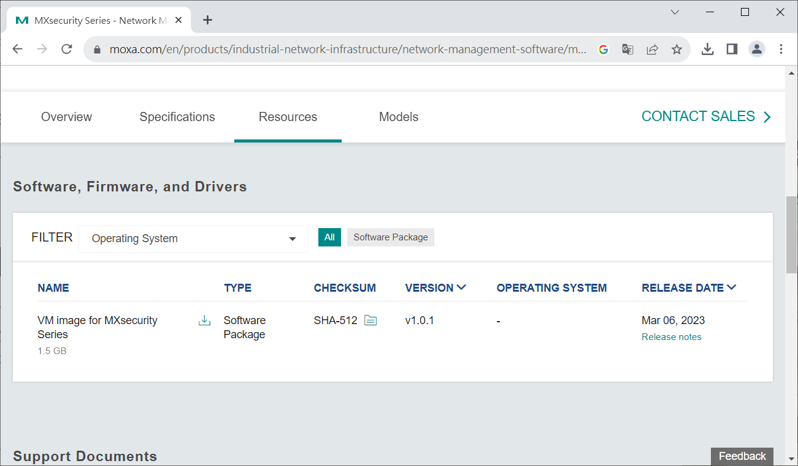

## CVE-2023-41440

- Date：2023-08-23
- Author：Sean Cai, HUANG, YU-HSIANG(Chris)

---

### Product Information

- Vendor：https://www.moxa.com/
- Product：Moxa MXsecurity Series
- Version：V1.0.1

### Description

The encryption information of the pkg file has been leaked and could potentially be exploited to create malicious files.

pkg檔的加密資訊遭到洩漏，可能遭到利用來建立惡意檔案。

### PoC

> AES-256-CBC

> Key：`*4*0*F***************0*0*0*`

> sha256