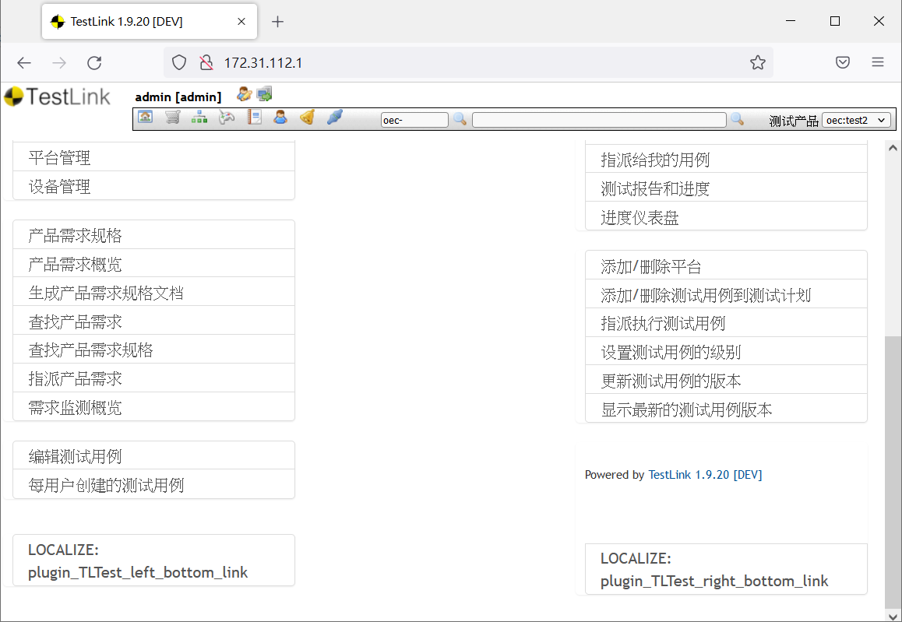

## CVE-2022-35195

- Author：HUANG, YU-HSIANG
- Contact：huang.yuhsiang.phone@gmail.com

---

### Product Information

- Vendor：https://www.testlink.org/
- Product：TestLink
- Version：1.9.20 Raijin

### Description

TestLink 1.9.20 Raijin was discovered to contain a broken access control vulnerability at /lib/attachments/attachmentdownload.php.

### PoC

- 
- 
- 